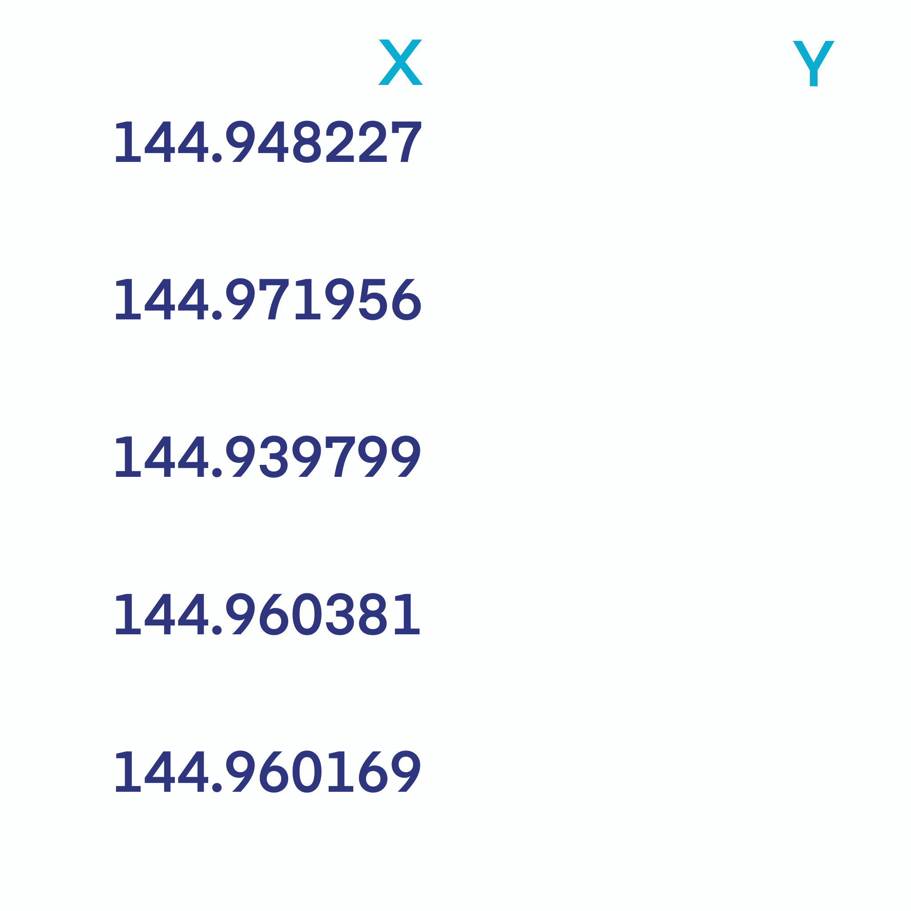

[](https://github.com/dcooley/interleave/actions)
[](https://codecov.io/gh/dcooley/interleave?branch=master)



# interleave

As the amazing gif shows, **interleaving** in this context means
converting a matrix into a vector, filled in a row-wise manner.

I’m building this library to be the workhorse for converting matrices
(and lists of matrices) into single, interleaved vectors, ready for
WebGL applications.

Here are some simple examples

``` r

( mat1 <- matrix(1:20, ncol = 2, byrow = T) )
#       [,1] [,2]
#  [1,]    1    2
#  [2,]    3    4
#  [3,]    5    6
#  [4,]    7    8
#  [5,]    9   10
#  [6,]   11   12
#  [7,]   13   14
#  [8,]   15   16
#  [9,]   17   18
# [10,]   19   20

interleave( mat1 )
#  [1]  1  2  3  4  5  6  7  8  9 10 11 12 13 14 15 16 17 18 19 20

( mat2 <- matrix(20:1, ncol = 5, byrow = T) )
#      [,1] [,2] [,3] [,4] [,5]
# [1,]   20   19   18   17   16
# [2,]   15   14   13   12   11
# [3,]   10    9    8    7    6
# [4,]    5    4    3    2    1

interleave( mat2 )
#  [1] 20 19 18 17 16 15 14 13 12 11 10  9  8  7  6  5  4  3  2  1

lst <- list( mat1, mat2 )

interleave( lst )
#  [1]  1  2  3  4  5  6  7  8  9 10 11 12 13 14 15 16 17 18 19 20 20 19 18 17 16
# [26] 15 14 13 12 11 10  9  8  7  6  5  4  3  2  1
```
